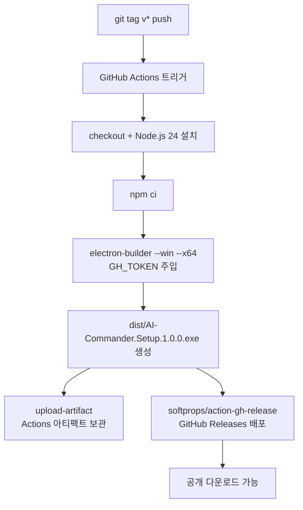

# (2026-07-01) GitHub Actions 릴리즈 자동 배포 수정

## 요약

태그 push 시 GitHub Actions 빌드가 `GH_TOKEN` 미설정으로 실패하던 문제를 해결했다.
총 4번의 커밋과 테스트(v1.0.6 ~ v1.0.9 태그)를 거쳐 Windows `.exe` 파일이 GitHub Releases에 자동 배포되는 파이프라인을 완성했다.

---

## 변경 사항

### GitHub Actions 워크플로우 수정

| 파일 | 변경 내용 |
|---|---|
| `.github/workflows/build.yml` | `GH_TOKEN` 환경변수 주입 추가 |
| `.github/workflows/build.yml` | `permissions: contents: write` 추가 |
| `.github/workflows/build.yml` | `softprops/action-gh-release@v2` 릴리즈 생성 스텝 추가 |
| `package.json` | `"publish": { "provider": "github", "releaseType": "release" }` 추가 |

---

## 결정 기록

### electron-builder publish 대신 softprops/action-gh-release 사용

- **상황**: `GH_TOKEN`과 `permissions: contents: write`를 추가해도 GitHub Release가 생성되지 않음 (빌드 자체는 성공). electron-builder가 내부적으로 draft 릴리즈를 생성하는 것으로 추정되나, 인증 없는 Public API로는 draft 확인 불가
- **선택지**:
  1. electron-builder의 publish 메커니즘 계속 디버깅
  2. `softprops/action-gh-release` 액션으로 명시적 릴리즈 생성
- **결정**: `softprops/action-gh-release@v2` 채택 — electron-builder publish 결과가 불투명하고, 전용 액션이 더 예측 가능하고 검증하기 쉬움
- **결과**: v1.0.9 태그에서 `AI-Commander.Setup.1.0.0.exe (72 MB)` 릴리즈 생성 확인

---

## 문제 및 해결

### 1. GH_TOKEN 미설정으로 빌드 실패

- **증상**: `⨯ GitHub Personal Access Token is not set, neither programmatically, nor using env "GH_TOKEN"`
- **원인**: electron-builder가 태그 감지 시 GitHub Releases 배포를 시도하지만, 워크플로우에 `GH_TOKEN`이 없었음
- **해결**: Build Windows 스텝에 `env: GH_TOKEN: ${{ secrets.GITHUB_TOKEN }}` 추가
- **검증**: Run #6 → 여전히 실패 (다음 문제로)

### 2. GITHUB_TOKEN 권한 부족

- **증상**: GH_TOKEN 추가 후에도 Run #6 실패
- **원인**: GitHub Actions의 기본 `GITHUB_TOKEN`은 read-only. Releases 생성에는 `contents: write` 권한 필요
- **해결**: 잡 레벨에 `permissions: contents: write` 추가
- **검증**: Run #7 성공 — 빌드 완료 및 아티팩트 72 MB 업로드 확인

### 3. GitHub Release가 생성되지 않음 (빌드는 성공)

- **증상**: Run #7, #8 모두 `conclusion: success`이지만 Public API에서 릴리즈 0건
- **원인**: electron-builder 기본 동작이 draft 릴리즈 생성 → Public API에서 draft는 미인증 요청에 비노출. `releaseType: "release"` 추가 후에도 동일 현상 (Run #8)
- **해결**: `softprops/action-gh-release@v2` 액션으로 교체 — 빌드된 `dist/*.exe`를 명시적으로 릴리즈에 첨부
- **검증**: Run #9 성공, `https://github.com/2sangjeong/windows_ai_tool/releases/tag/v1.0.9` 릴리즈 공개 확인

---

## 아키텍처

---

## Git 히스토리

| 커밋 | 메시지 |
|---|---|
| `b21ca4c` | fix: add GH_TOKEN to build step for GitHub Releases publishing |
| `d9fb327` | fix: add contents:write permission for GitHub Releases publishing |
| `e2d6146` | fix: set publish releaseType to release for public GitHub Releases |
| `a5899eb` | fix: use softprops/action-gh-release for explicit GitHub Releases creation |

테스트 태그: `v1.0.6` (실패) → `v1.0.7` (빌드 성공, 릴리즈 미생성) → `v1.0.8` (빌드 성공, 릴리즈 미생성) → `v1.0.9` (완전 성공)

---

## 다음 할 일

- [ ] `package.json`의 `version` 필드를 태그 버전과 동기화하는 방안 검토 (현재 `1.0.0` 고정, 태그는 `v1.0.9`)
- [ ] 기존 Draft 릴리즈(v1.0.7, v1.0.8 빌드 시 생성됐을 가능성) GitHub 웹에서 수동 정리
